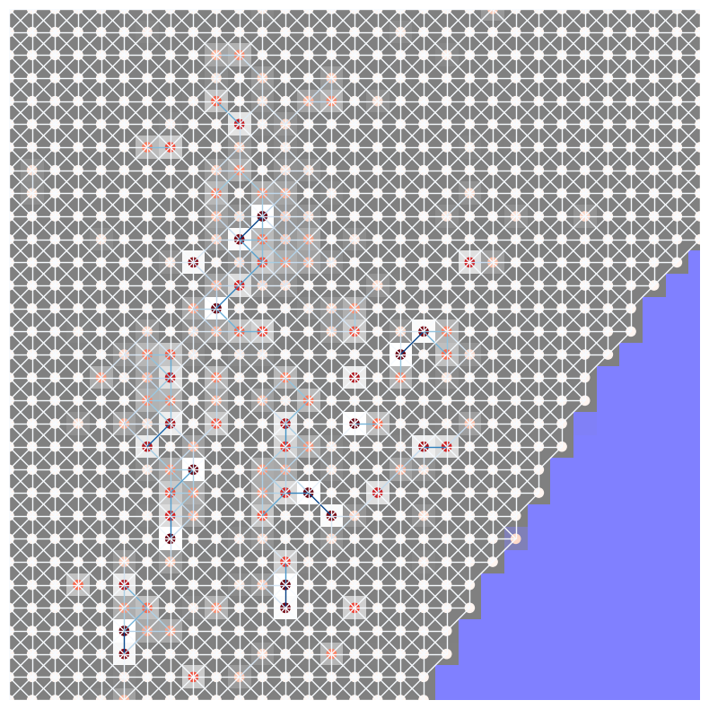
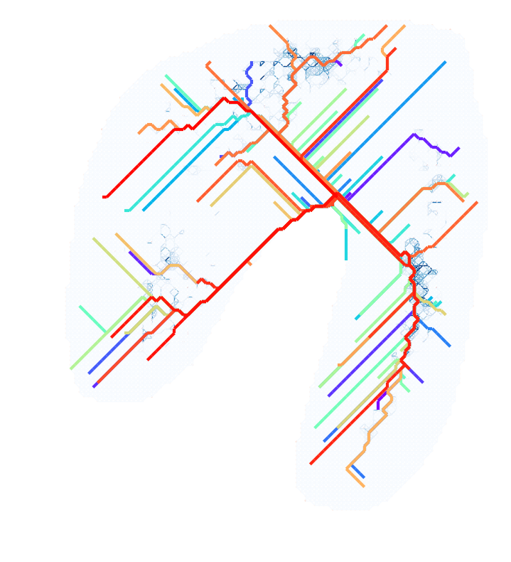

# Path-Prediction-Vasculogenesis


Tool for predicting blood island growth from images, using a stochastic shortest path model combined with continuous cellular automata.

<p align="center">
  
  
</p>


**Features**

**1. Network setup from an input image, designating blood island weight based on image intensity (continuous, not discrete).**

**2. Option to simulate random shortest paths from the embryo posterior, or from a random start point.**

**3. Visualisation of network structure and paths.**

**4. In development: continuous cellular automata based on Lenia framework.**


**Installation and use**

```bash

git clone git@github.com:izzy-cole/Path-Prediction-Vasculogenesis.git
cd Path-Prediction-Vasculogenesis

pip install -r requirements.txt

```

Run  *shortest_path_stochastic.ipynb* on the example dataset or a custom one.


